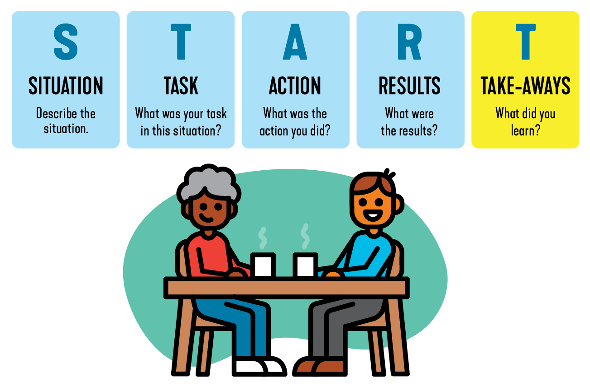

# SDE 3 and Above Interview Preparation Guide

This guide will help you prepare for a data structure and algorithm (DS/Algo) question in a MAANG interview as an SDE 3 with 7 years of experience. It outlines structured and strategic approaches as well as additional topics to ensure comprehensive preparation.

## Table of Contents
1. [Tackling DS/Algo Questions](#tackling-ds--algo-questions)
2. [Core Topics](#core-topics)
   - [Data Structures & Algorithms (DSA)](#data-structures--algorithms-dsa)
   - [SOLID Principles & Design Patterns](#solid-principles--design-patterns)
   - [YAGNI, DRY, and KISS Principles](#yagni-dry-and-kiss-principles)
   - [Low-Level Design (LLD)](#low-level-design-lld)
   - [High-Level Design (HLD)](#high-level-design-hld)
   - [Behavioral & Leadership Interviews](#behavioral--leadership-interviews)
   - [Advanced Programming Concepts](#advanced-programming-concepts)
   - [Mock Interviews & Timed Practice](#mock-interviews--timed-practice)
   - [System Design Deep Dive](#system-design-deep-dive)
   - [CI/CD & DevOps Knowledge](#cicd--devops-knowledge)
   - [Cross-Functional Collaboration & Leadership](#cross-functional-collaboration--leadership)

## Tackling DS/Algo Questions

1. **Understand the Problem Statement**
   - **Clarify Requirements**: Carefully read the problem. Clarify ambiguities by asking questions to ensure a full understanding of inputs, outputs, edge cases, and constraints.
   - **Restate the Problem**: Summarize the problem to the interviewer in your own words to confirm your understanding.
   - **Identify Constraints**: Understand the time and space complexity constraints and ensure your solution will meet these requirements.

2. **Approach & High-Level Plan**
   - **Brute Force Solution**: First, explain a brute force approach, even if it's inefficient. This demonstrates that you know how to start tackling the problem.
   - **Optimal Approach**: After explaining brute force, move to an optimized approach. Discuss potential data structures or algorithms that could make the solution more efficient (e.g., binary search, dynamic programming, etc.).
   - **Talk Out Loud**: Share your thought process with the interviewer. Highlight your considerations like edge cases, time/space complexity trade-offs, and whether the problem can be solved iteratively or recursively.

3. **Optimization and Complexity Analysis**
   - **Analyze Time & Space Complexity**: Calculate the complexity of your approach using Big O notation.
   - **Optimize**: If there’s room for improvement, explain how you could optimize the solution further by using better algorithms or more efficient data structures.

4. **Pseudocode**
   - **Draft Pseudocode**: Once you've discussed and optimized your solution, outline the logic in pseudocode.
   - **Structured Approach**: Focus on structuring your logic with clarity. Break it into small, manageable functions or steps, ensuring modularity.
   - **Edge Cases**: Mention edge cases you’ll handle in your pseudocode (e.g., empty inputs, duplicates, large datasets, etc.).

5. **Implementation**
   - **Write Clean Code**: Implement the solution in Python with readable and maintainable code. Follow Pythonic principles, and make sure you write clean, self-explanatory code.
     - **Use Classes & Functions**: If applicable, encapsulate your logic into classes or functions. Follow SOLID principles like single responsibility and open/closed principles.
     - **Use Design Patterns**: Apply design patterns where applicable. For instance, if you need to manage different algorithms, consider the Strategy pattern. If using recursion, ensure it’s clear and optimized (e.g., using memoization).
   - **Code Modularity**: Break down your solution into clear methods/functions. Each method should do one thing well.
   - **Exception Handling**: Add meaningful error and exception handling to ensure robustness.

6. **Test Your Solution**
   - **Test Cases**: Start with basic test cases and then handle edge cases. Mention how you would test for performance, such as handling large input sizes.
   - **Dry Run**: Walk through the code with an example to demonstrate its correctness and efficiency.

7. **Reflection & Further Optimization**
   - **Discuss Limitations**: Reflect on your solution, stating where it could be improved or scaled further.
   - **Iterate if Needed**: If time allows, consider further improvements or refactor sections to make them cleaner or more efficient.

### By following this structured process, you’ll demonstrate problem-solving ability, code optimization skills, and a solid understanding of software engineering principles, which are crucial at the SDE 3 level.

## Core Topics

### Data Structures & Algorithms (DSA)
- **Core Topics**: Arrays, Strings, Hashing, Binary Search, Sorting, Two Pointers, Sliding Window.
- **Advanced Topics**: Recursion, Dynamic Programming, Graphs (BFS, DFS), Trees, Greedy Algorithms, Divide and Conquer, Backtracking, Bit Manipulation.
- **Resources**: Neetcode’s 150/Blind 75, Leetcode, Cracking the Coding Interview.

### SOLID Principles & Design Patterns
- **SOLID Principles**: Single Responsibility, Open-Closed, Liskov Substitution, Interface Segregation, Dependency Inversion.
- **Design Patterns**: Creational (Factory, Singleton), Structural (Adapter, Decorator), Behavioral (Observer, Strategy).
- **Resources**: Refactoring.Guru, “Head First Design Patterns,” Python examples.

### YAGNI, DRY, and KISS Principles
- **Key Concepts**: YAGNI (You Aren’t Gonna Need It), DRY (Don’t Repeat Yourself), KISS (Keep It Simple, Stupid).
- **Resources**: “Clean Code” by Robert Martin, examples in daily coding practice.

### Low-Level Design (LLD)
- **Key Focus**: Object-oriented design, Class diagrams, Design of systems like Parking Lot, ATM, Library Management.
- **Resources**: Grokking the Object-Oriented Design Interview, LLD practice problems.

### High-Level Design (HLD)
- **Key Focus**: System design (load balancers, databases, caching, sharding, microservices, scaling).
- **Topics to Study**: CAP theorem, database replication, distributed systems, event-driven architecture.
- **Resources**: System Design Primer, “Designing Data-Intensive Applications” by Martin Kleppmann, HLD mock interviews.

### Behavioral & Leadership Interviews
- **Key Focus**: Leadership, teamwork, conflict resolution, ownership.
- **Method**: STAR (Situation, Task, Action, Result) for structuring responses.
- **Common Questions**: Leadership in tight deadlines, conflict with team members, handling large projects.
- **Resources**: “Cracking the PM Interview,” Mock interviews with peers.

### Advanced Programming Concepts
- **Python Deep Dive**: Asyncio, Decorators, Generators, Memory management, Threading.
- **Testing**: Unit testing, Integration testing, PyTest for Python.
- **Resources**: Fluent Python, Effective Python, Code review practice.

### Mock Interviews & Timed Practice
- **Key Focus**: Simulate interview environments, solve problems under time constraints.
- **Resources**: Leetcode, Pramp, Interviewing.io, peer mock interviews.

### System Design Deep Dive
- **Key Topics**: Tech stack selection, trade-offs in system design (performance vs. consistency, availability vs. partitioning).
- **Real-World Examples**: Systems like Netflix, Uber, Facebook, WhatsApp architecture.
- **Resources**: Read case studies, design large-scale systems, discuss with peers.

### CI/CD & DevOps Knowledge
- **Key Focus**: Tools like Docker, Kubernetes, Jenkins, AWS architecture, scaling systems.
- **Resources**: AWS documentation, DevOps tools guides, Kubernetes workshops.

### Cross-Functional Collaboration & Leadership
- **Key Focus**: Leading teams, cross-functional collaboration, conflict resolution.
- **Resources**: Leadership-focused mock interviews, case studies on team management.

## 📌 Fundamental Concepts
- [Basics OOP Concepts](https://blog.algomaster.io/p/basic-oop-concepts-explained-with-code)
- [SOLID Principles with Pictures](https://medium.com/backticks-tildes/the-s-o-l-i-d-principles-in-pictures-b34ce2f1e898)
- [SOLID Principles with Code](https://blog.algomaster.io/p/solid-principles-explained-with-code)
- [DRY Principle](https://blog.algomaster.io/p/082450d8-0e7b-4447-a8dc-b7308e45f048)
- [YAGNI Principle](https://blog.algomaster.io/p/8c3c7da7-885b-4a9c-a6e4-70ee02de4772)
- [KISS Principle](https://blog.algomaster.io/p/21b57678-b351-4ed4-b390-3b6308af2f7d)
- [Coursera - Object-Oriented Design](https://www.coursera.org/learn/object-oriented-design)

### OOPs Concepts:

1. **Abstraction**
   - Hiding the complex implementation details and showing only the necessary parts to the user.
2. **Encapsulation**
   - Binding the data (attributes) and code (methods) that operates on the data into a single unit.
3. **Inheritance**
   - Inheritance is a mechanism where a class acquires the properties and behaviors of another class.
4. **Polymorphism**
   - Polymorphism allows you to define a single interface or method in a base class and have multiple derived classes implement or override that method.

### SOLID Principles:

1. **Single Responsibility Principle**
   - A class should have only one responsibility.
2. **Open/Closed Principle**
   - Software entities (classes, modules, functions, etc.) should be open for extension but closed for modification.
3. **Liskov Substitution Principle**
   - Objects of a superclass should be replaceable with objects of a subclass without affecting the correctness of the program.
4. **Interface Segregation Principle**
   - Clients should not be forced to depend on interfaces they do not use.
5. **Dependency Inversion Principle**
   - High-level modules should not depend on low-level modules. Both should depend on abstractions.
   - Abstractions should not depend on details. Details should depend on abstractions.

### Design Patterns:

https://refactoring.guru/design-patterns

#### Creational Patterns
Creational patterns deal with object creation mechanisms, trying to create objects in a manner suitable to the situation.

- **Singleton**: Ensures a class has only one instance and provides a global point of access to it.
- **Factory**: Defines an interface for creating objects, but lets subclasses alter the type of objects that will be created.
- **Abstract Factory**: Provides an interface for creating families of related or dependent objects without specifying their concrete classes.
- **Builder**: Separates the construction of a complex object from its representation, allowing the same construction process to create different representations.
- **Prototype**: Creates new objects by copying an existing object, known as the prototype.
- **Object Pool**: Manages a pool of reusable objects, optimizing the performance by reusing objects rather than creating and destroying them frequently.

#### Structural Patterns
Structural patterns deal with object composition or the structure of classes and objects, ensuring that if one part changes, the entire structure can still function properly.

- **Adapter**: Allows incompatible interfaces to work together, converting one interface into another that a client expects.
- **Bridge**: Separates an object’s abstraction from its implementation so that the two can vary independently.
- **Composite**: Composes objects into tree structures to represent part-whole hierarchies, allowing clients to treat individual objects and compositions of objects uniformly.
- **Decorator**: Adds additional responsibilities to an object dynamically, providing a flexible alternative to subclassing for extending functionality.
- **Facade**: Provides a simplified interface to a complex subsystem, making it easier to use.
- **Flyweight**: Reduces the cost of creating and manipulating a large number of similar objects by sharing as much data as possible.
- **Proxy**: Provides a surrogate or placeholder for another object to control access to it.

#### Behavioral Patterns
Behavioral patterns deal with communication between objects, outlining patterns of how objects interact and distribute responsibility.

- **Chain of Responsibility**: Passes a request along a chain of handlers, allowing multiple objects an opportunity to handle the request without coupling the sender with the receiver.
- **Command**: Encapsulates a request as an object, thereby allowing for parameterization of clients with queues, requests, and operations.
- **Interpreter**: Defines a grammar for a language and interprets sentences in the language.
- **Iterator**: Provides a way to access the elements of an aggregate object sequentially without exposing its underlying representation.
- **Mediator**: Defines an object that encapsulates how a set of objects interact, promoting loose coupling by keeping objects from referring to each other explicitly.
- **Memento**: Captures and restores an object's internal state without violating encapsulation.
- **Observer**: Defines a one-to-many dependency between objects so that when one object changes state, all its dependents are notified and updated automatically.
- **State**: Allows an object to alter its behavior when its internal state changes.
- **Strategy**: Defines a family of algorithms, encapsulates each one, and makes them interchangeable.
- **Template Method**: Defines the skeleton of an algorithm in a method, deferring some steps to subclasses.
- **Visitor**: Represents an operation to be performed on elements of an object structure, allowing one to define new operations without changing the classes of the elements on which it operates.

# Common Questions:

### DS & ALGO Common Patterns:

https://neetcode.io/roadmap
video[https://www.youtube.com/watch?v=DjYZk8nrXVY]
1. **Prefix Sum**
2. **Two Pointer**
3. **Sliding Window**
4. **Fast & Slow Pointer**
5. **Linked List In-Place Reversal**
6. **Monotonic Stack**
7. **Top 'k' Elements**
8. **Quick Select**
9. **Overlapping Intervals**
10. **Modified Binary Search**
11. **Depth-First Search(DFS)**
12. **Breadth-First Search(BFS)**
13. **Matrix Traversal**
14. **Backtracking**
15. **Dynamic Programming**

### LLD: - video[https://www.youtube.com/watch?v=OhCp6ppX6bg]

https://github.com/ashishps1/awesome-low-level-design
#### 10 Common LLD Interview Problems
1. **Design a parking lot** [Design a parking lot](https://docs.google.com/document/d/1gP56IvFveexv_zi5RNlNEGTa9bpEp4ocyDk54bcj1Oo/edit?usp=sharing)
2. **Design a vending machine** [Design a vending machine]()
3. **Design an elevator system** [Design an elevator system]()
4. **Design LRU cache** [Design LRU cache]()
5. **Design a chess game** [Design a chess game]()
6. **Design snake and ladders** [Design snake and ladders]()
7. **Design Splitwise** [Design Splitwise]()
8. **Design logging framework** [Design logging framework]()
9. **Design hotel management system** [Design hotel management system]()
10. **Design movie ticket booking syetem** [Design movie ticket booking syetem]()

### System Design: - video[https://www.youtube.com/watch?v=l3X1t3kpmwY]

https://github.com/ashishps1/awesome-system-design-resources
#### 10 Common System Design Problems
1. **Design a URL shortening service like TinyURL**
2. **Design a social media platform like Twitter/Instagram**
3. **Design a chat application like WhatsApp/Slack**
4. **Design a web crawler**
5. **Design a video streaming service like YouTube/Netflix**
6. **Design an e-commerce platform like Amazon**
7. **Design a ride-sharing service like Uber/Lyft**
8. **Design a notification system**
9. **Design a key-value store like Redis**
10. **Design a scalable logging and monitoring system**

### Behavioral & Leadership Interviews:

#### Common Questions
1. **Leadership in Tight Deadlines**
2. **Conflict with Team Members**
3. **Handling Large Projects**
4. **Mentoring Junior Engineers**
5. **Workplace Conflict Resolution**

